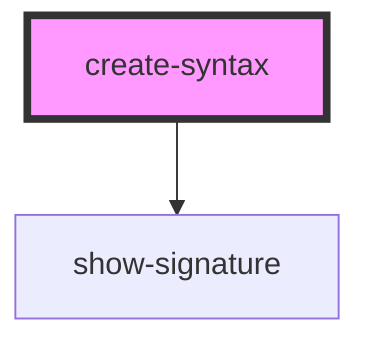

# create-syntax

<!-- Auto Generated Below -->

## Events

| Event           | Description | Type                       |
| --------------- | ----------- | -------------------------- |
| `syntaxUpdated` |             | `CustomEvent<Set<string>>` |

## Dependencies

### Depends on

- [show-signature](../show-signature)

### Graph

----------------------------------------------

*Built with [StencilJS](https://stenciljs.com/)*
