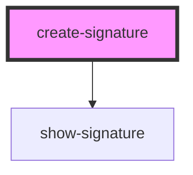

# create-syntax

<!-- Auto Generated Below -->

## Properties

| Property  | Attribute  | Description | Type     | Default |
| --------- | ---------- | ----------- | -------- | ------- |
| `maxSize` | `max-size` |             | `number` | `10`    |

## Events

| Event              | Description | Type                                      |
| ------------------ | ----------- | ----------------------------------------- |
| `signatureUpdated` |             | `CustomEvent<Set<PropositionalVariable>>` |

## Shadow Parts

| Part       | Description |
| ---------- | ----------- |
| `"button"` |             |
| `"input"`  |             |

## Dependencies

### Depends on

- [show-signature](../show-signature)

### Graph

----------------------------------------------

*Built with [StencilJS](https://stenciljs.com/)*
