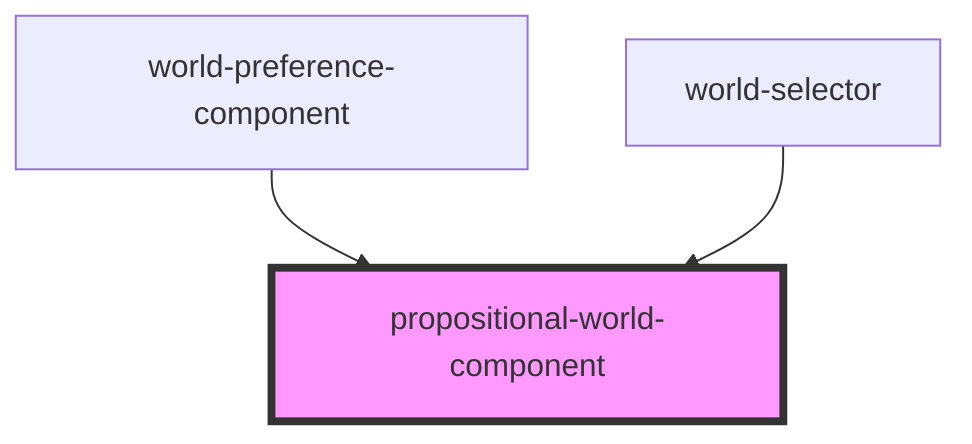

# propositional-world

<!-- Auto Generated Below -->

## Properties

| Property | Attribute | Description         | Type                 | Default     |
| -------- | --------- | ------------------- | -------------------- | ----------- |
| `world`  | --        | Propositional world | `PropositionalWorld` | `undefined` |

## Dependencies

### Used by

 - [world-preference-component](../world-preference)
 - [world-selector](../world-selector)

### Graph

----------------------------------------------

*Built with [StencilJS](https://stenciljs.com/)*
