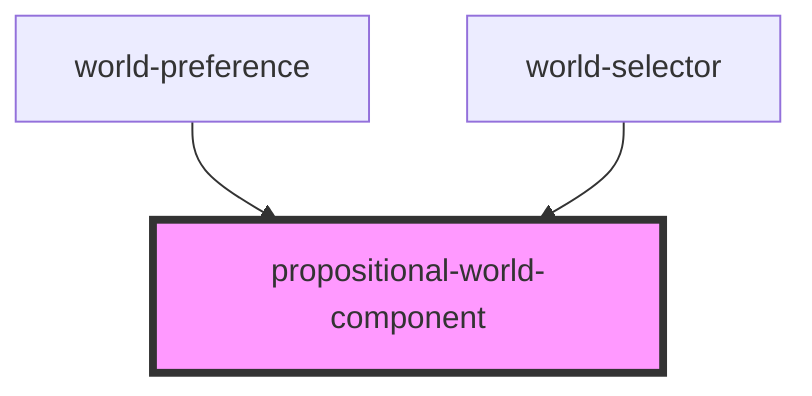

# propositional-world

<!-- Auto Generated Below -->

## Properties

| Property         | Attribute | Description                        | Type                           | Default     |
| ---------------- | --------- | ---------------------------------- | ------------------------------ | ----------- |
| `interpretation` | --        | Interpretation for the world       | `(formula: string) => boolean` | `undefined` |
| `syntax`         | --        | Propositional Syntax for the world | `Set<string>`                  | `undefined` |

## Dependencies

### Used by

 - [world-preference](../world-preference)
 - [world-selector](../world-selector)

### Graph

----------------------------------------------

*Built with [StencilJS](https://stenciljs.com/)*
