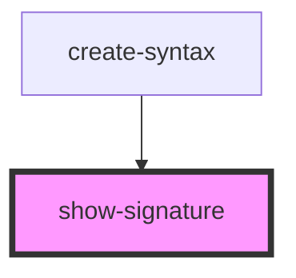

# show-signature

<!-- Auto Generated Below -->

## Properties

| Property    | Attribute | Description | Type          | Default     |
| ----------- | --------- | ----------- | ------------- | ----------- |
| `signature` | --        |             | `Set<string>` | `undefined` |

## Dependencies

### Used by

 - [create-syntax](../create-syntax)

### Graph

----------------------------------------------

*Built with [StencilJS](https://stenciljs.com/)*
