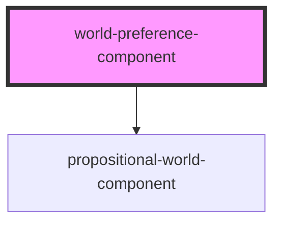

# world-preference

<!-- Auto Generated Below -->

## Properties

| Property         | Attribute | Description             | Type              | Default                   |
| ---------------- | --------- | ----------------------- | ----------------- | ------------------------- |
| `allowEmptyRows` | --        | Allow empty rows or not | `Boolean`         | `false`                   |
| `preference`     | --        | Preference over worlds  | `WorldPreference` | `new WorldPreference([])` |

## Events

| Event               | Description | Type                           |
| ------------------- | ----------- | ------------------------------ |
| `preferenceChanged` |             | `CustomEvent<WorldPreference>` |

## Dependencies

### Depends on

- [propositional-world-component](../propositional-world-component)

### Graph

----------------------------------------------

*Built with [StencilJS](https://stenciljs.com/)*
