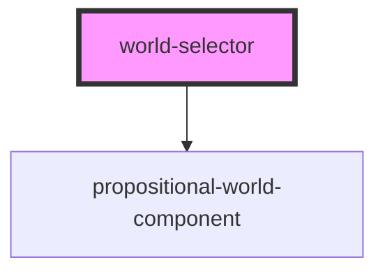

# world-selector

<!-- Auto Generated Below -->

## Properties

| Property | Attribute | Description    | Type                   | Default |
| -------- | --------- | -------------- | ---------------------- | ------- |
| `worlds` | --        | List of worlds | `PropositionalWorld[]` | `[]`    |

## Events

| Event             | Description | Type                              |
| ----------------- | ----------- | --------------------------------- |
| `worldDeselected` |             | `CustomEvent<PropositionalWorld>` |
| `worldSelected`   |             | `CustomEvent<PropositionalWorld>` |

## Dependencies

### Depends on

- [propositional-world-component](../propositional-world-component)

### Graph

----------------------------------------------

*Built with [StencilJS](https://stenciljs.com/)*
